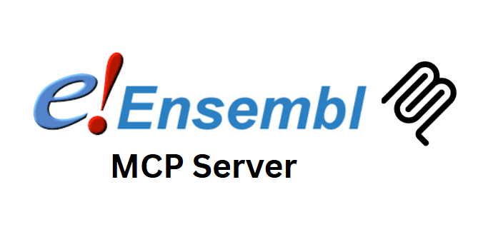

# Unofficial Ensembl MCP Server

A comprehensive Model Context Protocol (MCP) server that provides access to the Ensembl REST API for genomic data, comparative genomics, and biological annotations.

**Developed by [Augmented Nature](https://augmentednature.ai)**

## Overview

This server enables seamless access to Ensembl's vast genomic database through a standardized MCP interface. It supports gene lookups, sequence retrieval, variant analysis, comparative genomics, regulatory features, and much more across multiple species.

## Features

### Gene & Transcript Information

- **Gene Lookup**: Get detailed gene information by Ensembl ID or gene symbol
- **Transcript Analysis**: Retrieve all transcripts for a gene with structural details
- **Gene Search**: Search genes by name, description, or identifier with filtering options

### Sequence Data

- **Genomic Sequences**: Extract DNA sequences for any genomic region or feature
- **CDS Sequences**: Get coding sequences for specific transcripts
- **Sequence Translation**: Translate DNA sequences to protein sequences
- **Repeat Masking**: Support for hard and soft repeat masking

### Comparative Genomics

- **Homolog Detection**: Find orthologous and paralogous genes across species
- **Phylogenetic Trees**: Generate gene family trees in multiple formats
- **Cross-Species Analysis**: Compare genes and genomes across different organisms

### Variant Data

- **Variant Retrieval**: Get genetic variants in genomic regions
- **Consequence Prediction**: Predict variant effects on genes and transcripts
- **Population Genetics**: Access allele frequencies and population data

### Regulatory Features

- **Regulatory Elements**: Access enhancers, promoters, and TFBS data
- **Motif Features**: Get transcription factor binding motifs
- **Cell Type Context**: Filter regulatory features by cell type

### Cross-References & Annotations

- **External Database Links**: Get cross-references to PDB, EMBL, RefSeq, etc.
- **Coordinate Mapping**: Convert coordinates between genome assemblies
- **Ontology Terms**: Access GO terms and functional annotations

### Species & Assembly Information

- **Species Lists**: Browse available species and assemblies
- **Assembly Statistics**: Get genome assembly information and statistics
- **Karyotype Data**: Access chromosome information and banding patterns

### Batch Processing

- **Batch Gene Lookup**: Process multiple genes simultaneously
- **Batch Sequence Fetch**: Retrieve sequences for multiple regions efficiently

## Installation

```bash
# Clone or download the server files
cd ensembl-server

# Install dependencies
npm install

# Build the server
npm run build
```

## Usage with Claude Desktop

### Setup Instructions

1. **Build the server** (if not already done):

   ```bash
   npm run build
   ```

2. **Add to Claude Desktop configuration**:

   - Open Claude Desktop
   - Go to Settings → MCP Servers
   - Add a new server with:
     - **Name**: `ensembl`
     - **Command**: `node`
     - **Args**: `/path/to/ensembl-server/build/index.js`

3. **Restart Claude Desktop** to load the server

### Available Tools (25 total)

#### Gene & Transcript Information

- `lookup_gene` - Get detailed gene information by stable ID or symbol
- `get_transcripts` - Get all transcripts for a gene with detailed structure
- `search_genes` - Search for genes by name, description, or identifier

#### Sequence Data

- `get_sequence` - Get DNA sequence for genomic coordinates or gene/transcript ID
- `get_cds_sequence` - Get coding sequence (CDS) for a transcript
- `translate_sequence` - Translate DNA sequence to protein sequence

#### Comparative Genomics

- `get_homologs` - Find orthologous and paralogous genes across species
- `get_gene_tree` - Get phylogenetic tree for gene family

#### Variant Data

- `get_variants` - Get genetic variants in a genomic region
- `get_variant_consequences` - Predict consequences of variants on genes and transcripts

#### Regulatory Features

- `get_regulatory_features` - Get regulatory elements in genomic region
- `get_motif_features` - Get transcription factor binding motifs in genomic region

#### Cross-References & Annotations

- `get_xrefs` - Get external database cross-references for genes
- `map_coordinates` - Convert coordinates between genome assemblies

#### Species & Assembly Information

- `list_species` - Get list of available species and assemblies
- `get_assembly_info` - Get genome assembly information and statistics
- `get_karyotype` - Get chromosome information and karyotype

#### Batch Processing

- `batch_gene_lookup` - Look up multiple genes simultaneously
- `batch_sequence_fetch` - Fetch sequences for multiple regions or features

### Example Usage in Claude Desktop

Once connected, you can use natural language to access genomic data:

- "Look up the BRCA2 gene and get its sequence"
- "Find orthologs of TP53 in mouse"
- "Get variants in the region chr17:43044295-43125364"
- "Search for insulin-related genes"
- "Get the assembly information for human genome"
- "Translate this DNA sequence to protein: ATGAAACGC..."

## Supported Species

The server supports all species available in Ensembl, including:

- **Vertebrates**: Human, Mouse, Rat, Zebrafish, etc.
- **Plants**: Arabidopsis, Rice, Wheat, etc.
- **Fungi**: Yeast, etc.
- **Protists**: Various protist species
- **Metazoa**: Drosophila, C. elegans, etc.

Default species is `homo_sapiens` when not specified.

## Input Formats

### Genomic Regions

- `chr1:1000000-2000000` - Standard format
- `1:1000000-2000000` - Without 'chr' prefix
- `ENSG00000139618` - Feature IDs

### Gene/Transcript IDs

- Ensembl IDs: `ENSG00000139618`, `ENST00000380152`
- Gene symbols: `BRCA2`, `TP53`
- RefSeq IDs: `NM_000059`

## Output Formats

### Primary Formats

- **JSON**: Structured data (default for most tools)
- **FASTA**: Sequence data
- **GFF**: Genomic feature format
- **VCF**: Variant call format

### Tree Formats

- **JSON**: Structured tree data
- **Newick**: Standard phylogenetic format
- **PhyloXML**: Rich phylogenetic format

## Error Handling

The server provides comprehensive error handling:

- **Invalid Parameters**: Clear validation messages
- **API Errors**: Detailed error information from Ensembl
- **Network Issues**: Timeout and connectivity error handling
- **Species Validation**: Automatic species name validation

## Rate Limiting

The server respects Ensembl's rate limiting guidelines:

- Maximum 15 requests per second
- Appropriate delays between batch operations
- Connection pooling for efficiency

## Configuration

### Environment Variables

- `ENSEMBL_BASE_URL`: Override default API base URL
- `REQUEST_TIMEOUT`: Set custom timeout (default: 30000ms)

### Species Configuration

- Default species: `homo_sapiens`
- Automatic species validation
- Support for all Ensembl divisions

## API Coverage

This server provides access to major Ensembl REST API endpoints:

### Lookup & Search

- `/lookup/id/{id}` - Gene/transcript lookup
- `/search` - Gene search functionality

### Sequences

- `/sequence/id/{id}` - Feature sequences
- `/sequence/region/{species}/{region}` - Genomic sequences

### Comparative Genomics

- `/homology/id/{id}` - Homology data
- `/genetree/id/{id}` - Gene trees

### Variation

- `/variation/region/{species}/{region}` - Variant data
- `/vep/species/{species}/region` - Variant effect prediction

### Regulation

- `/regulatory/species/{species}/region/{region}` - Regulatory features
- `/regulatory/species/{species}/microarray/{region}` - Motif features

### Cross-references

- `/xrefs/id/{id}` - External database references
- `/map/coords/{species}/{assembly}/{region}` - Coordinate mapping

### Information

- `/info/species` - Available species
- `/info/assembly/{species}` - Assembly information

## Support

For issues related to:

- **Server functionality**: Check server logs and error messages
- **Ensembl data**: Refer to [Ensembl documentation](https://rest.ensembl.org/)
- **API usage**: See [Ensembl REST API guide](https://github.com/Ensembl/ensembl-rest/wiki)

## Contributing

Contributions are welcome! Please ensure:

- TypeScript compliance
- Comprehensive error handling
- Documentation updates
- Test coverage for new features

## Related Tools

This server integrates well with other bioinformatics MCP servers:

- **UniProt Server**: Protein data integration
- **AlphaFold Server**: 3D structure predictions
- **STRING Server**: Protein interaction networks
- **PDB Server**: Structural biology data

## About Augmented Nature

This Ensembl MCP Server is developed by [Augmented Nature](https://augmentednature.ai), a company focused on building AI-powered tools for scientific research and discovery.


## Citation
If you use this project in your research or publications, please cite it as follows:

```bibtex @misc{ensemblmcp2025, 
author = {Moudather Chelbi},
title = {Ensembl MCP Server},
year = {2025},
howpublished = {https://github.com/Augmented-Nature/Ensembl-MCP-Server},
note = {Accessed: 2025-06-29}
