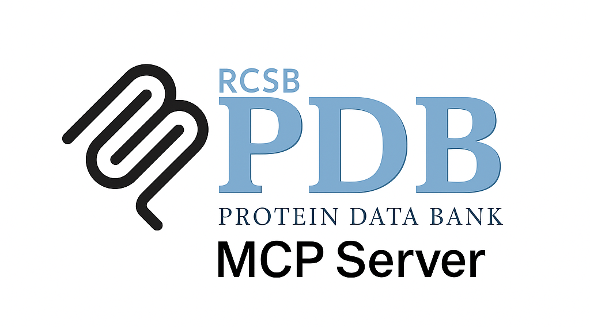

# PDB MCP Server

A Model Context Protocol (MCP) server that provides access to the Protein Data Bank (PDB) - the worldwide repository of information about the 3D structures of proteins, nucleic acids, and complex assemblies.

## Features

### Tools

- **search_structures**: Search PDB database for protein structures by keyword, protein name, or PDB ID
- **get_structure_info**: Get detailed information for a specific PDB structure
- **download_structure**: Download structure coordinates in various formats (PDB, mmCIF, mmTF, XML)
- **search_by_uniprot**: Find PDB structures associated with a UniProt accession
- **get_structure_quality**: Get structure quality metrics and validation data

### Resources

- **pdb://structure/{pdb_id}**: Complete structure information for a PDB ID
- **pdb://coordinates/{pdb_id}**: Structure coordinates in PDB format
- **pdb://mmcif/{pdb_id}**: Structure data in mmCIF format
- **pdb://validation/{pdb_id}**: Structure validation data and quality metrics
- **pdb://ligands/{pdb_id}**: Ligand and binding site information
- **pdb://search/{query}**: Search results for structures matching the query

## Installation

```bash
npm install
npm run build
```

## Usage

### With Claude Desktop

Add to your `claude_desktop_config.json`:

```json
{
  "mcpServers": {
    "pdb-server": {
      "command": "node",
      "args": ["/path/to/pdb-server/build/index.js"]
    }
  }
}
```

### Example Queries

1. **Search for insulin structures**:

   ```
   Use the search_structures tool to find insulin protein structures
   ```

2. **Get information about a specific structure**:

   ```
   Get detailed information about PDB structure 1ABC using get_structure_info
   ```

3. **Download structure coordinates**:

   ```
   Download the PDB file for structure 1ABC using download_structure
   ```

4. **Find structures for a UniProt protein**:

   ```
   Find PDB structures for UniProt accession P01308 using search_by_uniprot
   ```

5. **Check structure quality**:

   ```
   Get validation metrics for PDB structure 1ABC using get_structure_quality
   ```

6. **Access resources directly**:
   ```
   Show me the resource pdb://structure/1abc
   ```

## API Integration

This server integrates with:

- **RCSB PDB REST API** (https://data.rcsb.org/): For structure metadata and information
- **RCSB PDB Search API** (https://search.rcsb.org/): For advanced search capabilities
- **RCSB PDB File Download** (https://files.rcsb.org/): For structure file downloads

## Structure Data Formats

- **PDB**: Original Protein Data Bank format
- **mmCIF**: Macromolecular Crystallographic Information File (newer standard)
- **mmTF**: Macromolecular Transmission Format (binary, compressed)
- **XML**: Extensible Markup Language format

## Quality Metrics

The server provides various structure quality indicators:

- Resolution (for X-ray crystallography)
- R-work and R-free values
- Ramachandran plot statistics
- Clash scores
- Rotamer outliers
- Model validation scores

## Complementary Servers

This PDB server works well with:

- **UniProt MCP Server**: For protein sequence and functional information
- **AlphaFold MCP Server**: For predicted protein structures

Together, these provide comprehensive access to protein structure and function data.

## Error Handling

The server includes robust error handling for:

- Invalid PDB IDs
- Network connectivity issues
- API rate limiting
- Missing structure files
- Malformed requests

## Development

```bash
# Install dependencies
npm install

# Build the server
npm run build

# Run in development mode
npm run dev
```

## Attribution

This project is developed by **Augmented Nature**
🌐 Website: [augmentednature.ai](https://augmentednature.ai)

## Citation
If you use this project in your research or publications, please cite it as follows:

```bibtex @misc{pdbmcp2025, 
author = {Moudather Chelbi},
title = {Protein Data Bank (PDB) MCP Server},
year = {2025},
howpublished = {https://github.com/Augmented-Nature/PDB-MCP-Server},
note = {Accessed: 2025-06-29}
